# 🎮 Tic Tac Toe

<div align="center">

<!-- CI/CD Badges -->
[](https://github.com/2026-DEV2-007-Hatem-NOUREDDINE/tictactoe/actions/workflows/android_check.yml)
[](https://github.com/2026-DEV2-007-Hatem-NOUREDDINE/tictactoe/actions/workflows/release.yml)
[](https://sonarcloud.io/dashboard?id=2026-DEV2-007-Hatem-NOUREDDINE_tictactoe)
[](https://sonarcloud.io/dashboard?id=2026-DEV2-007-Hatem-NOUREDDINE_tictactoe)

**A modern Android Tic Tac Toe game built with Clean Architecture and Test-Driven Development**


> ## About this Kata
>
> This short and simple Kata should be performed using **Test Driven Development** (TDD).
>
> ## Rules
>
> The rules are described below :
>
> - X always goes first.
> - Players cannot play on a played position.
> - Players alternate placing X's and O's on the board until either:
> - One player has three in a row, horizontally, vertically or diagonally
> - All nine squares are filled.
> - If a player is able to draw three X's or three O's in a row, that player wins.
> - If all nine squares are filled and neither player has three in a row, the game is a draw.
>
> ## Useful link
>
> Clean Code - TDD : https://cleancoders.com/episode/clean-code-episode-6-p1
>
> **IMPORTANT:**  Implement the requirements focusing on **writing the best code** you can produce.

---

## 📋 Table of Contents

| Section                                                             | Description                           |
|---------------------------------------------------------------------|---------------------------------------|
| [🏠 Architecture](#1-application-architecture)                      | Clean Architecture & module structure |
| [🛠️ Technical Choices](#2-technical-choices)                       | Technology stack & design decisions   |
| [✅ Code Quality](#3-code-quality-and-cicd)                          | CI/CD, testing, and quality tools     |
| [🤝 Contributing](#4-contribution-guidelines--conventions)          | Git workflow & conventions            |
| [🧪 TDD Deep Dive](#5-a-deep-dive-into-test-driven-development-tdd) | Test-Driven Development approach      |
| [▶️ Running](#6-how-to-run-the-project)                             | How to build and run                  |
| [📸 Screenshots](#7-screenshot-testing-visual-regression)           | Visual regression testing             |
| [📂 Files](#8-file-organization)                                    | Project structure                     |

---

## 1. Application Architecture

This project follows the **Clean Architecture** pattern, which promotes a separation of concerns and a high degree of independence from external
frameworks.

### Module Dependency Graph

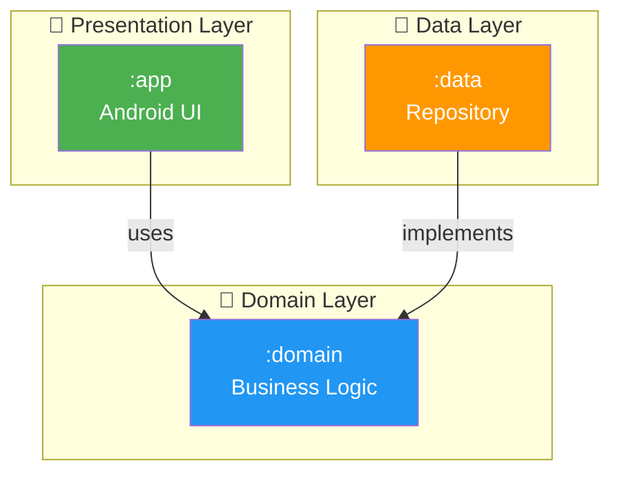

### Data Flow

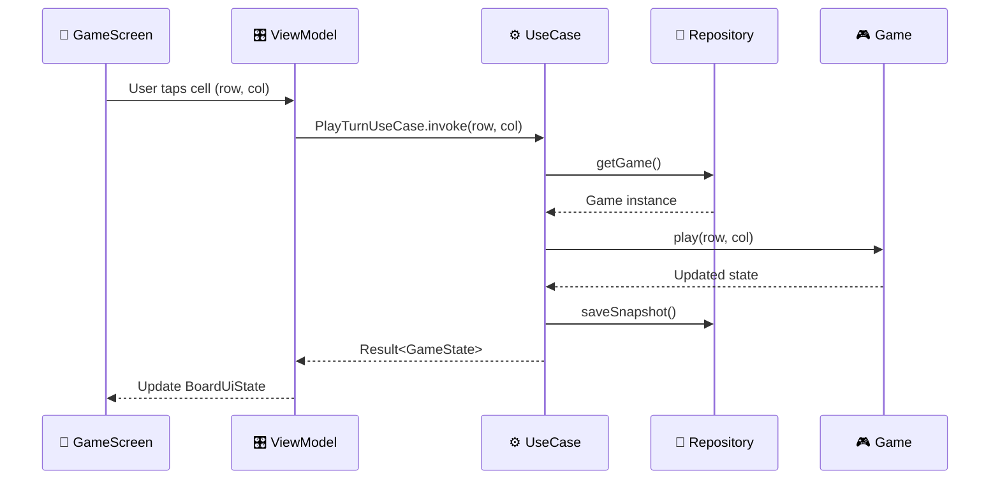

### Component Details

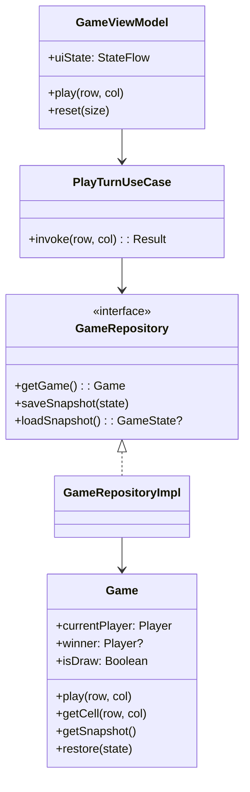

### Layer Descriptions

| Layer            | Module    | Responsibility                              |
|------------------|-----------|---------------------------------------------|
| **Presentation** | `:app`    | UI, ViewModel, Compose components           |
| **Domain**       | `:domain` | Game logic, UseCases, Repository interface  |
| **Data**         | `:data`   | Repository implementation, data persistence |

### Key Principles

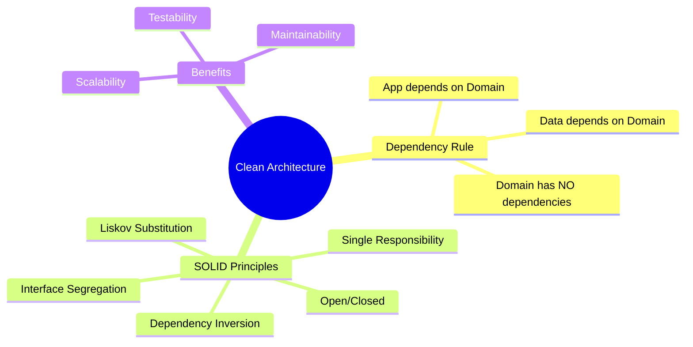

---

## 2. Technical Choices

### Technology Stack

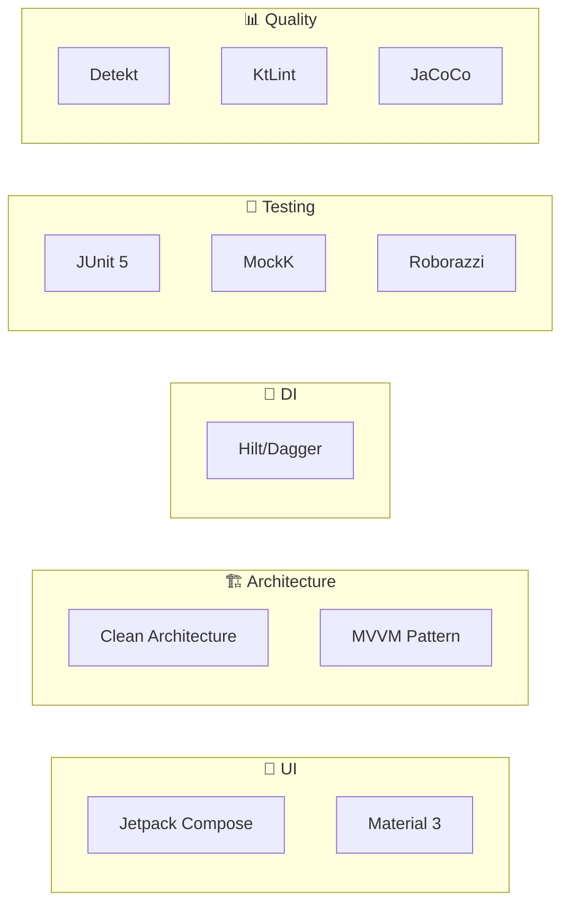

| Technology             | Purpose                                            |
|------------------------|----------------------------------------------------|
| **Kotlin**             | Official language for modern Android development   |
| **Jetpack Compose**    | Modern declarative UI toolkit for native Android   |
| **Hilt**               | Dependency injection for improved testability      |
| **Clean Architecture** | Separation of concerns and maintainability         |
| **JUnit 5**            | Modern testing framework with nested tests support |
| **MockK**              | Kotlin-native mocking library                      |
| **Roborazzi**          | Screenshot testing for visual regression           |

### UI Features

- **Edge-to-Edge Display**: Modern, immersive UI drawing behind system bars
- **Material 3**: Following the latest Material Design guidelines
- **Animations**: Smooth shake animation on game over
- **Haptic Feedback**: Tactile feedback for user actions

---

## 3. Code Quality and CI/CD

### Quality Tools Overview

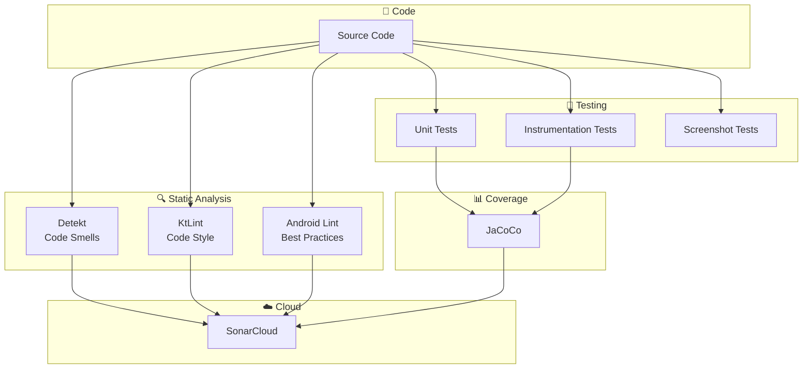

### CI/CD Pipeline Architecture

Our CI pipeline uses **6 parallel jobs** for maximum efficiency:

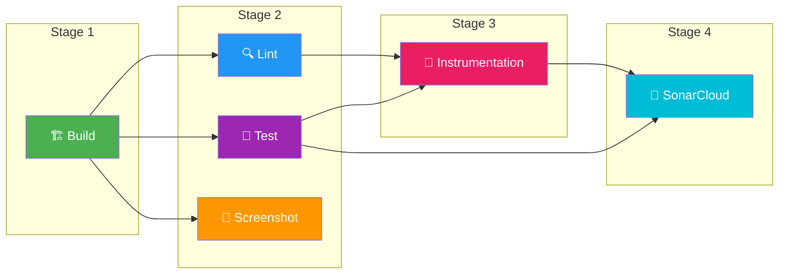

| Job                 | Description                          | Depends On            |
|---------------------|--------------------------------------|-----------------------|
| **Build**           | Compiles debug APK, caches artifacts | -                     |
| **Lint**            | Runs Detekt, KtLint, Android Lint    | Build                 |
| **Test**            | Unit tests with JaCoCo coverage      | Build                 |
| **Screenshot**      | Roborazzi visual regression tests    | Build                 |
| **Instrumentation** | Emulator-based UI tests              | Lint, Test            |
| **SonarCloud**      | Code quality analysis                | Test, Instrumentation |

### JaCoCo Coverage Tasks

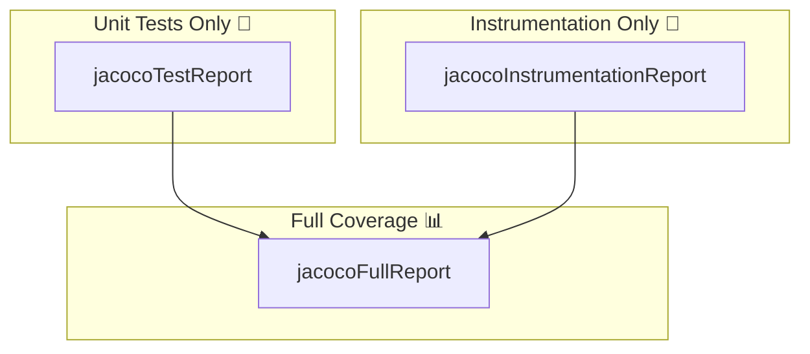

```bash
# Unit tests coverage only (fast, debug variant)
./gradlew jacocoTestReport

# Instrumentation tests coverage only (requires emulator)
./gradlew jacocoInstrumentationReport

# Full coverage report (unit + instrumentation)
./gradlew jacocoFullReport
```

### Test Coverage by Module

| Module    | Test Types                     | Coverage Target |
|-----------|--------------------------------|-----------------|
| `:app`    | Unit, Screenshot, Instrumented | 80%             |
| `:domain` | Unit (TDD)                     | 100%            |
| `:data`   | Unit                           | 80%             |

### Key CI Features

- **⚡ Gradle Build Cache**: Intelligent caching for faster builds
- **🔄 Concurrency Control**: Cancels redundant workflow runs
- **📊 Rich Summaries**: Detailed GitHub Step Summaries with:
    - Test counts (passed/failed/skipped)
    - Coverage with visual progress bars
    - Links to HTML reports
    - Screenshot comparisons
- **🎚️ KVM Acceleration**: Faster emulator tests
- **📦 Artifact Uploads**: All reports downloadable

### 🚀 Auto-Release Workflow

When code is **merged to `main`**, an automatic release is created:


| Property           | Value                        |
|--------------------|------------------------------|
| **Trigger**        | Push to `main` (after merge) |
| **Version Format** | `YYYY.MM.DD-commit`          |
| **Tag Format**     | `vYYYY.MM.DD-commit`         |
| **APK Name**       | `tictactoe-{version}.apk`    |
| **Changelog**      | Auto-generated from commits  |

> 💡 The workflow ignores changes to `.md` files and snapshots to avoid unnecessary releases.

### Running Locally

```bash
# Full static analysis check
./gradlew detekt ktlintCheck lintDebug

# Unit tests with coverage
./gradlew testDebugUnitTest jacocoTestReport

# Screenshot tests
./gradlew verifyRoborazziDebug

# Record new screenshots
./gradlew recordRoborazziDebug

# Full SonarCloud analysis
./gradlew detekt ktlintCheck lintDebug testDebugUnitTest jacocoTestReport detektReportMergeXml sonar
```

### Static Analysis Reports

After running the static analysis tasks, HTML reports are available per module:

| Report          | Path                                      |
|-----------------|-------------------------------------------|
| 🔎 Detekt       | `*/build/reports/detekt/detekt.html`      |
| 📝 KtLint       | `*/build/reports/ktlint/*/*.html`         |
| 📱 Android Lint | `*/build/reports/lint-results-debug.html` |

### Required GitHub Configuration

| Type     | Name                     | Description                         |
|----------|--------------------------|-------------------------------------|
| Secret   | `SONAR_TOKEN`            | Authentication token for SonarCloud |
| Variable | `SONAR_PROJECT_KEY`      | Your SonarCloud project identifier  |
| Variable | `SONAR_ORGANIZATION_KEY` | Your SonarCloud organization        |

---

## 4. Contribution Guidelines & Conventions

### Git Workflow

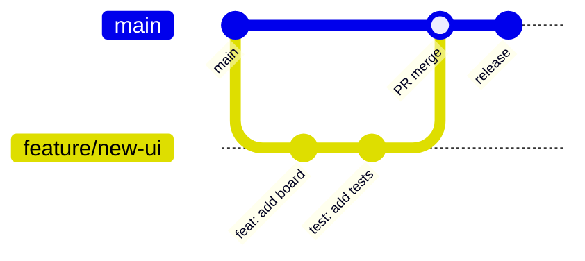

### Git Hooks

Install them with:

```bash
./gradlew installGitHooks
```

### Commit Convention

We follow **Conventional Commits**:

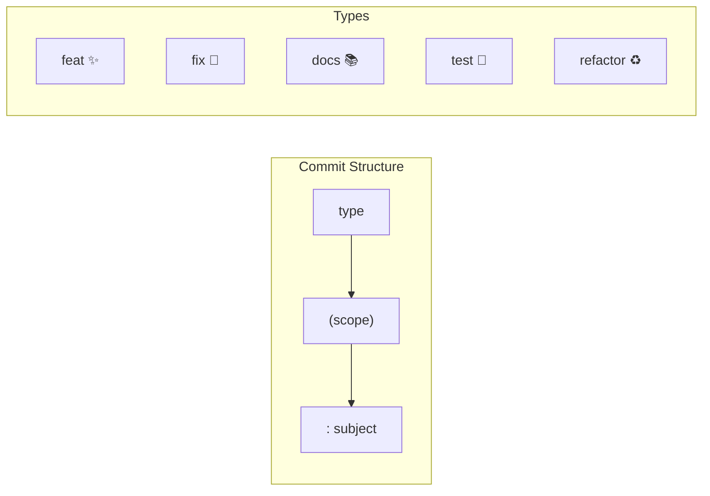

| Type       | Description      | Example                            |
|------------|------------------|------------------------------------|
| `feat`     | New feature      | `feat(ui): add game board`         |
| `fix`      | Bug fix          | `fix(game): correct win detection` |
| `docs`     | Documentation    | `docs: update README`              |
| `test`     | Tests            | `test(game): add TDD tests`        |
| `refactor` | Code refactoring | `refactor: extract helper`         |
| `style`    | Formatting       | `style: apply ktlint`              |
| `chore`    | Maintenance      | `chore: update deps`               |
| `ci`       | CI changes       | `ci: add sonar job`                |

### Branch Naming

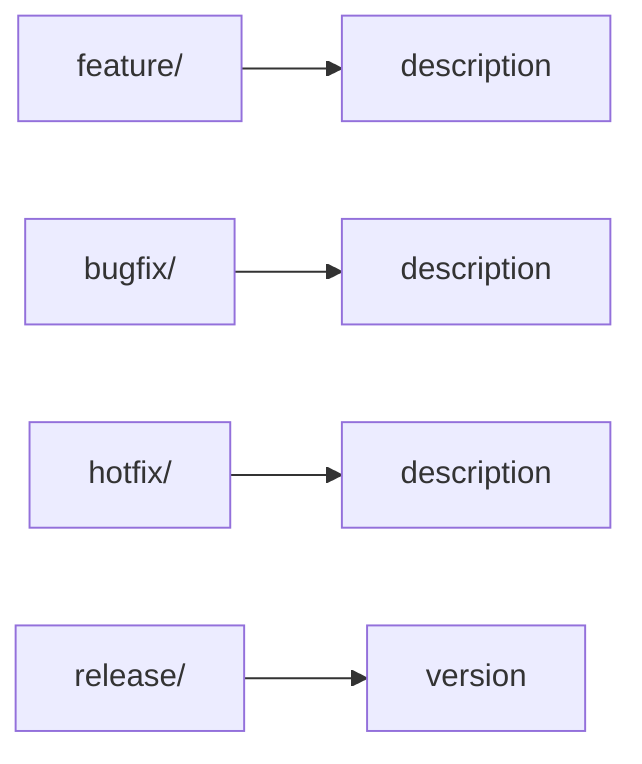

---

## 5. A Deep Dive into Test-Driven Development (TDD)

### The TDD Cycle

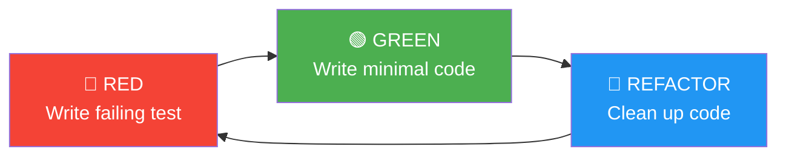

### TDD Timeline for Game Class

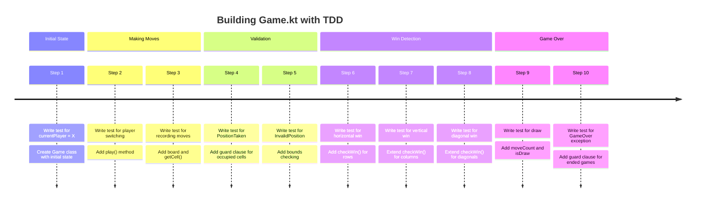

### Test Structure Mapping to Rules

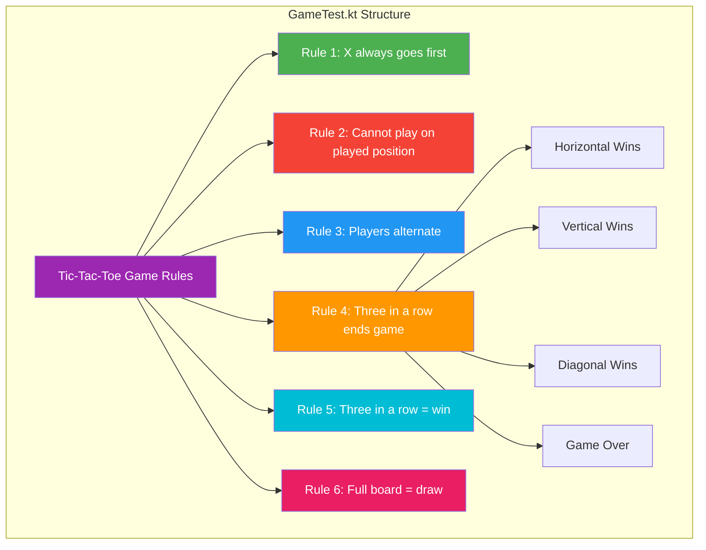

### TDD Step-by-Step Example

#### Step 1: Initial State (Rule 1)

**🔴 RED**: Write a failing test

```kotlin
@Test
fun `new game should start with Player X`() {
    val game = Game() // ❌ Fails: Game doesn't exist
    assertEquals(Player.X, game.currentPlayer)
}
```

**🟢 GREEN**: Write minimal code

```kotlin
class Game {
    val currentPlayer: Player = Player.X
}
```

#### Step 2: Making Moves (Rule 3)

**🔴 RED**: Test player switching

```kotlin
@Test
fun `after X plays, it should be O's turn`() {
    val game = Game()
    game.play(0, 0) // ❌ Fails: play() doesn't exist
    assertEquals(Player.O, game.currentPlayer)
}
```

**🟢 GREEN**: Add play method

```kotlin
fun play(row: Int, col: Int) {
    currentPlayer = Player.O
}
```

**🔵 REFACTOR**: Make it generic

```kotlin
fun play(row: Int, col: Int) {
    currentPlayer = if (currentPlayer == Player.X) Player.O else Player.X
}
```

#### Step 3: Invalid Moves (Rule 2)

**🔴 RED**: Test occupied cell

```kotlin
@Test
fun `playing on occupied cell should throw PositionTaken`() {
    val game = Game()
    game.play(0, 0)
    assertThrows<GameException.PositionTaken> {
        game.play(0, 0) // ❌ Fails: no exception thrown
    }
}
```

**🟢 GREEN**: Add guard clause

```kotlin
fun play(row: Int, col: Int) {
    if (board[row][col] != null) {
        throw GameException.PositionTaken()
    }
    // ... rest of method
}
```

---

## 6. How to Run the Project

### Prerequisites

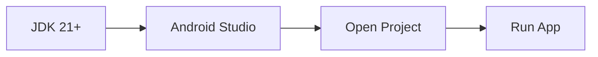

* JDK 21 or higher
* Android Studio Ladybug or higher

### Commands

```bash
# Run Unit Tests (TDD Check)
./gradlew :domain:test

# Build the Application
./gradlew :app:assembleDebug

# Install on device
./gradlew :app:installDebug

# Run all tests with coverage
./gradlew jacocoTestReport
```

---

## 7. Screenshot Testing (Visual Regression)

### Roborazzi Workflow

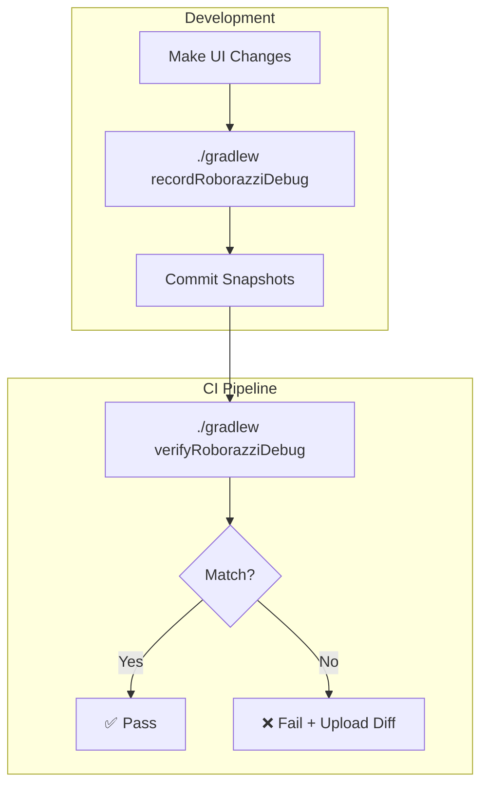

### Commands

```bash
# Record new/updated screenshots
./gradlew recordRoborazziDebug

# Verify screenshots match
./gradlew verifyRoborazziDebug
```

### Handling Failures

1. Download the `screenshot-report` artifact
2. Open `index.html` to compare expected vs actual
3. If changes are intentional:
   ```bash
   ./gradlew recordRoborazziDebug
   ```
4. Commit the updated snapshots

---

## 8. File Organization

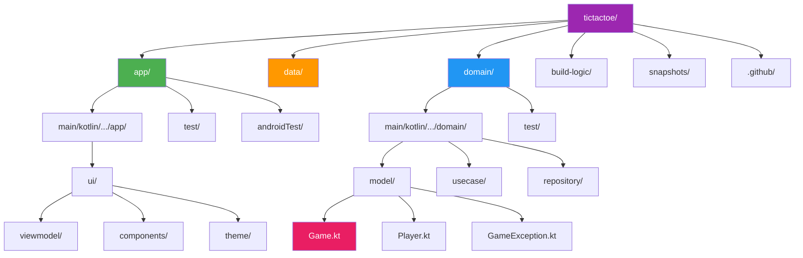

### Directory Structure

```
.
├── app/                  # 📱 Android Module (UI)
│   └── src/
│       ├── main/kotlin/.../app/
│       │   ├── ui/
│       │   │   ├── GameScreen.kt
│       │   │   ├── viewmodel/GameViewModel.kt
│       │   │   ├── components/{Board, Cell, GameControls, GameStatus}.kt
│       │   │   └── theme/{Color, Theme, Type}.kt
│       │   └── di/
│       ├── test/             # Unit + Screenshot tests
│       └── androidTest/      # Instrumentation tests
│
├── data/                 # 💾 Data Module
│   └── src/main/kotlin/.../data/
│       ├── di/DataModule.kt
│       └── repository/GameRepositoryImpl.kt
│
├── domain/               # 🧠 Domain Module (Pure Kotlin)
│   └── src/
│       ├── main/kotlin/.../domain/
│       │   ├── model/{Game, Player, GameState, GameException}.kt
│       │   ├── repository/GameRepository.kt
│       │   └── usecase/{PlayTurn, Reset, Load, GetSnapshot}UseCase.kt
│       └── test/             # TDD unit tests
│
├── build-logic/          # 🔧 Convention Plugins
│   └── convention/
│       └── src/main/kotlin/
│           ├── DetektConventionPlugin.kt
│           ├── KtLintConventionPlugin.kt
│           ├── JacocoConventionPlugin.kt
│           ├── JacocoReportConventionPlugin.kt
│           └── SonarConventionPlugin.kt
│
├── snapshots/            # 📸 Roborazzi golden images
│   └── roborazzi/
│
└── .github/workflows/    # 🚀 CI/CD
    └── android_check.yml
```

---

## 📄 License

This project is created for the **BNP Paribas Kata** exercise.

---

<div align="center">

### 🏆 Built with Excellence

**Clean Architecture** • **Test-Driven Development** • **100% Coverage**

[](https://sonarcloud.io/summary/new_code?id=2026-DEV2-007-Hatem-NOUREDDINE_tictactoe)

Made with ❤️ by [Hatem NOUREDDINE](https://github.com/2026-DEV2-007-Hatem-NOUREDDINE)

</div>
